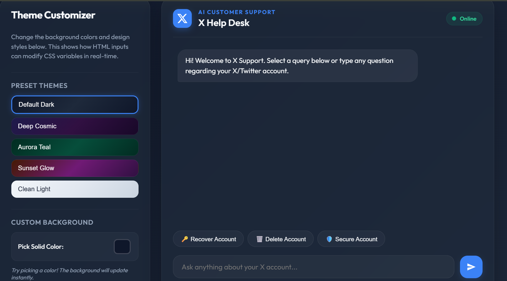
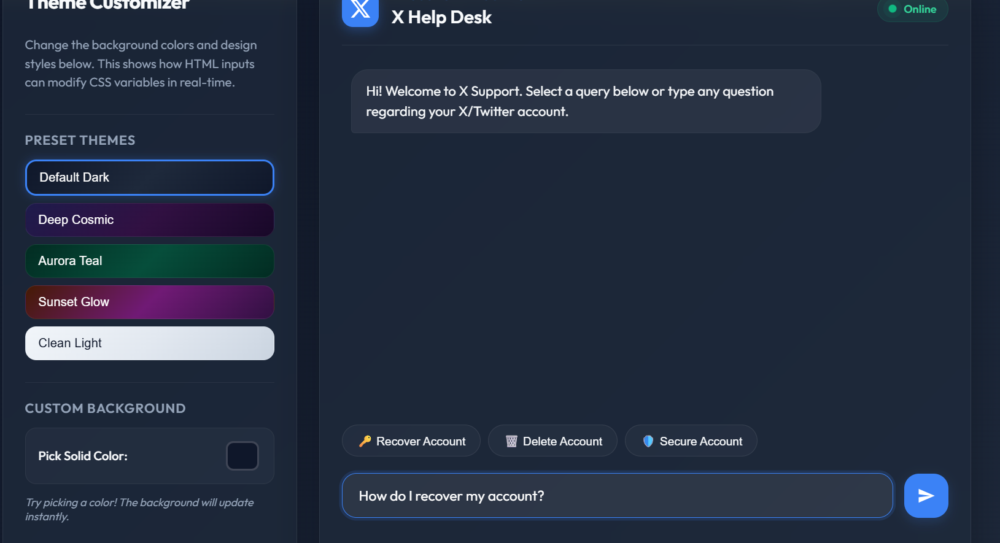

# Ai Powered Chatbot

## Home Interface

Displays the main X Help Desk chatbot interface with a clean and modern design.
Provides quick access buttons for common support requests such as account recovery and security.
Features customizable themes and a user-friendly layout for improved user experience.

## Description
An AI-powered chatbot that provides accurate support for Twitter/X account management, security, and recovery using LLMs and RAG.

## Chat Conversation

Demonstrates real-time interaction between the user and the AI-powered support assistant.
Processes customer queries and generates context-aware responses using NLP and LLM technologies.
Offers a conversational experience to help users resolve account-related issues efficiently.

## heme Customization
.png)
Allows users to personalize the chatbot interface using multiple predefined themes.
Supports dynamic background color changes and real-time UI updates.
Enhances accessibility and user engagement through customizable visual preferences.

## Features
- Customer query resolution
- NLP-based intent recognition
- Document-based Q&A
- Prompt engineering
- RAG-powered responses

  

## Technologies Used
- Python
- NLP
- LLMs
- RAG
- Git
- GitHub
