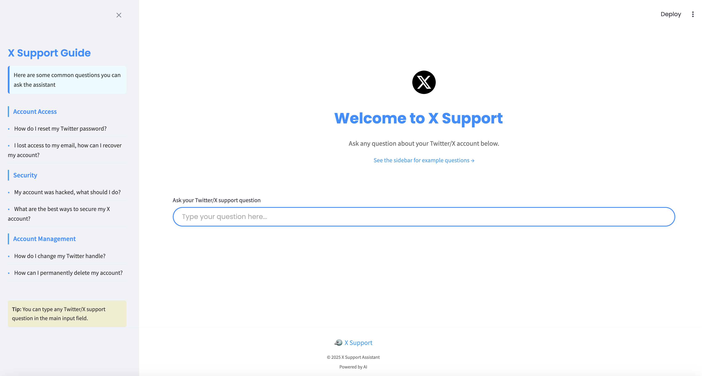
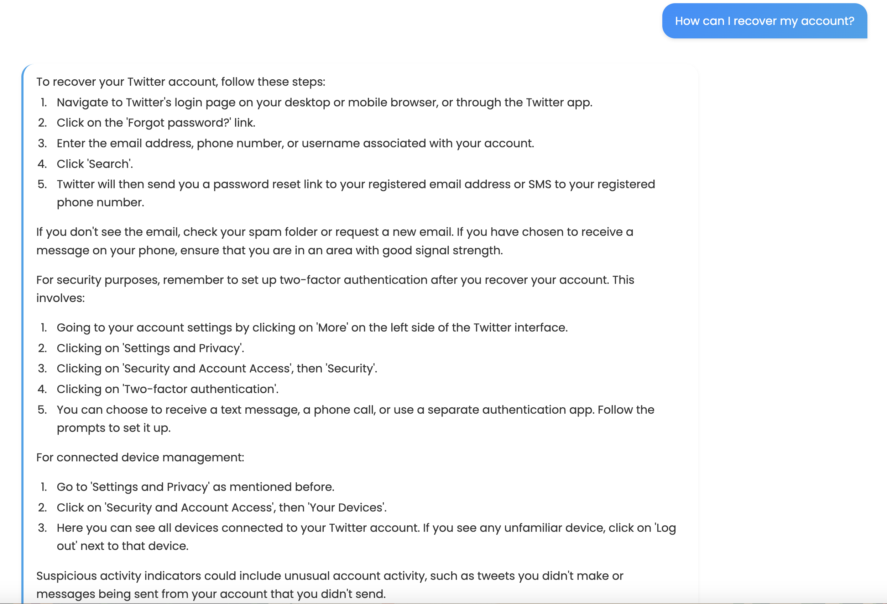
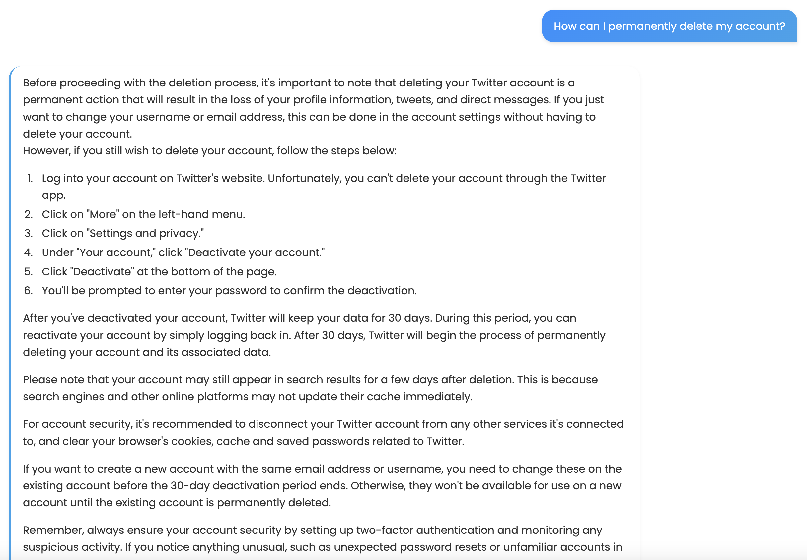

# X Customer Support Chatbot

A modern, AI-powered chatbot for Twitter/X customer support inquiries with a clean, user-friendly interface.



## Overview

The **X Customer Support Chatbot** is an advanced conversational assistant designed to address customer queries related to Twitter/X. Leveraging state-of-the-art language models and retrieval-augmented generation, this chatbot offers precise and efficient responses to frequently asked questions about account management, security, and recovery.

## Features

- **Intuitive User Interface**: Clean, modern design with Streamlit
- **AI-Powered Responses**: Uses OpenAI's GPT models for natural language generation
- **Context-Aware**: Retrieves relevant information using FAISS vector search
- **Accurate Answers**: Provides detailed step-by-step solutions to common Twitter/X problems

## Example Use Cases

The chatbot can help with questions such as:

### Account Recovery


### Account Deletion


## Project Structure

```
X-CustomerSupport-Chatbot/
├── app.py                 # Main Streamlit application
├── api_key_test.py        # Utility to test OpenAI API key
├── requirements.txt       # Project dependencies
├── data/                  # Training and reference data
├── images/                # Screenshot images
├── models/                # Pre-trained models and indices
└── src/                   # Source code modules
    ├── chatbot_with_langchain.py  # Core chatbot implementation
    ├── embeddings.py              # Vector embedding generation
    ├── generate_response.py       # Response generation utilities
    ├── key_verification.py        # API key verification
    ├── preprocess.py              # Text preprocessing utilities
    └── retrieval.py               # Context retrieval functionality
```

## Source Code Files Explained

### Main Application

- **app.py**: The Streamlit web application that provides the user interface for interacting with the chatbot. It handles the chat history, user input, and displays responses in a clean, modern UI.

### Core Components

- **src/chatbot_with_langchain.py**: The main chatbot implementation using LangChain for orchestrating the conversation flow. It combines context retrieval with language model generation to provide accurate responses.

- **src/retrieval.py**: Handles the retrieval of relevant context from the FAISS index using semantic similarity search. When a user asks a question, this module finds the most relevant support information to inform the response.

- **src/embeddings.py**: Generates and manages vector embeddings for text data using SentenceTransformer models. These embeddings enable semantic search for retrieving relevant context.

- **src/preprocess.py**: Text preprocessing module that cleans and normalizes Twitter/X support data, including tokenization, contraction fixing, and other text normalization steps.

- **src/generate_response.py**: Contains utilities for generating responses based on the user query and retrieved context.

- **src/key_verification.py**: Utility module to verify OpenAI API keys and ensure proper configuration.

### Utilities

- **api_key_test.py**: A standalone script to test the validity of OpenAI API keys before running the main application.

## Technical Stack

- **Frontend**: Streamlit
- **NLP/ML**: 
  - OpenAI GPT models
  - SentenceTransformers for embeddings
  - FAISS for vector similarity search
  - LangChain for orchestration
- **Data Processing**:
  - Pandas, NumPy for data manipulation
  - spaCy for linguistic preprocessing
- **Storage**:
  - FAISS index for vector storage
  - CSV files for reference data

## Setup and Installation

### Prerequisites

- Python 3.8+
- OpenAI API key

### Installation

1. Clone the repository:
   ```bash
   git clone https://github.com/yourusername/X-CustomerSupport-Chatbot.git
   cd X-CustomerSupport-Chatbot
   ```

2. Create and activate a virtual environment:
   ```bash
   python -m venv venv
   source venv/bin/activate  # On Windows: venv\Scripts\activate
   ```

3. Install dependencies:
   ```bash
   pip install -r requirements.txt
   ```

4. Set up your OpenAI API key:
   - Create a `.env` file in the project root
   - Add your API key: `OPENAI_API_KEY=your_key_here`

### Running the Application

Launch the Streamlit application:
```bash
streamlit run app.py
```

The application will be accessible at http://localhost:8501 in your web browser.

## Using the Chatbot

1. Enter your question in the input field at the bottom of the screen
2. Click the "Submit" button or press Enter
3. The chatbot will process your query and display a response
4. You can continue the conversation with follow-up questions
5. Use the example questions in the sidebar for guidance

## How It Works

1. **User Input**: The user enters a question about Twitter/X support.
2. **Context Retrieval**: The system converts the question into an embedding and searches for relevant information in the FAISS index.
3. **Response Generation**: The retrieved context and user query are sent to the language model, which generates a comprehensive response.
4. **Conversation Memory**: The chatbot maintains conversation history to provide context-aware responses for follow-up questions.

## Technologies Used

- **LangChain**: For orchestrating the components of the chatbot and managing conversation flow
- **OpenAI GPT Models**: For generating human-like responses based on context
- **FAISS**: Facebook AI Similarity Search for efficient vector similarity search
- **SentenceTransformers**: For generating high-quality text embeddings
- **Streamlit**: For creating the interactive web interface
- **Pandas & NumPy**: For data processing and manipulation
- **spaCy**: For natural language processing and text preprocessing

## License

[MIT License](LICENSE)

## Acknowledgements

- OpenAI for providing the language models
- Streamlit for the excellent web application framework
- LangChain for the LLM orchestration framework
